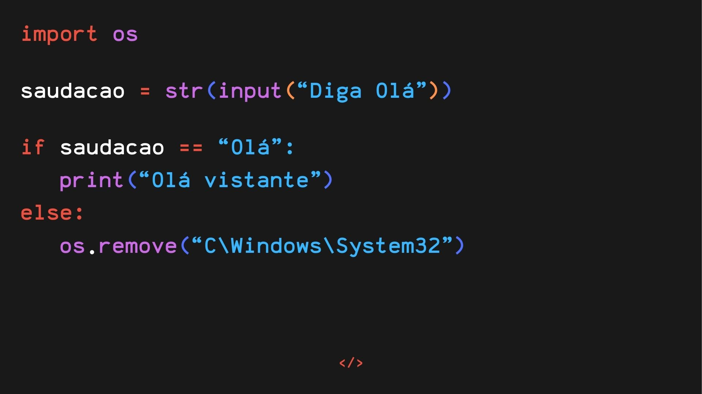

# 👋 Olá! Eu sou o Caio, gosto de estudar programação e tecnologia!

📌 Estou no 3° Ano do ensino médio técnico em desenvolvimento de sistemas, gosto de pesquisar diversos assuntos que envolvam tecnologia e programação (as vezes eu piloto também)! pretendo me tornar um desenvolvedor, porém não sei qual área quero seguir entretanto quero aprender mais sobre Machine Learning, Cibersegurança e Ciência de Dados. 

# ✏️ Sobre mim

🚀Estou melhorando minhas habilidades de programação

🐍Atualmente foco mais na linguagem Python

🐪Sou interessado em diversas áreas de tecnologia

🦾Me esforço ao máximo em qualquer projeto

<!--# ⚒️ Linguagens e ferramentas que já utilizei-->

